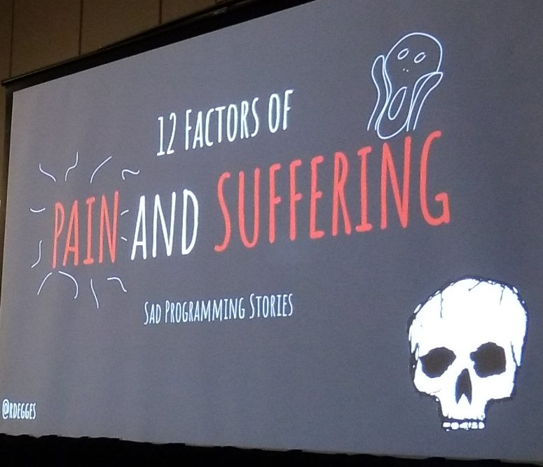
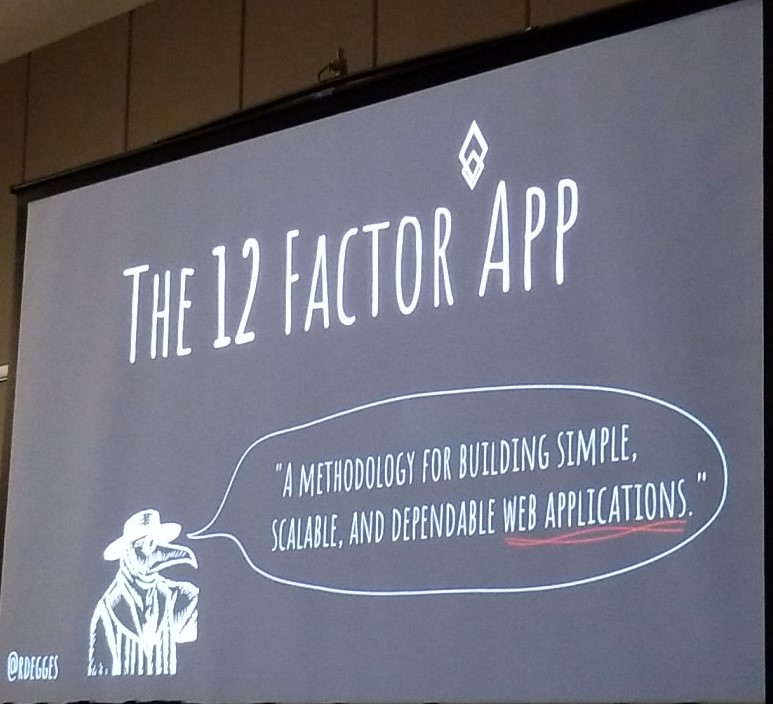
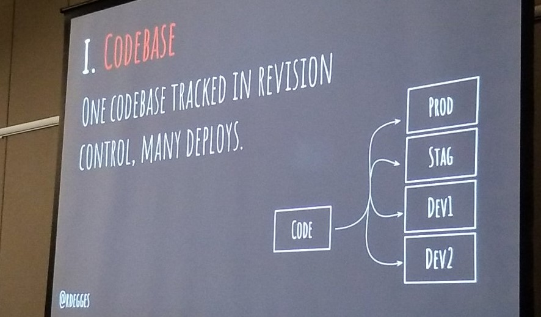
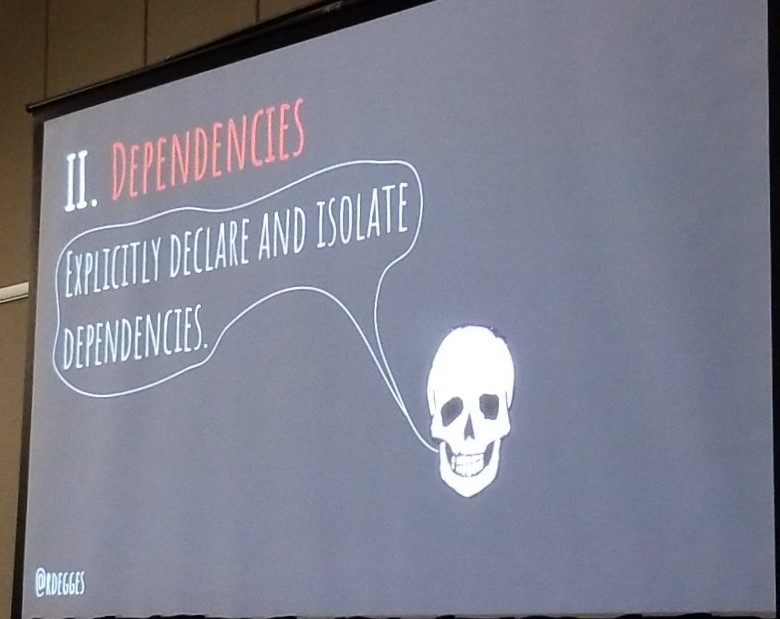

# 12 Factors of Pain and Suffering

* Randall Degges
* 7/18/2019 11:15am
* https://www.rdegges.com/

<!-- Summary: -->
A life-time developer took us through the 12 Factor of app development but with a twist, all of his mistakes that he made. It was funny and introduced me to the [12 factors of app development](https://thenewstack.io/12-factor-app-streamlines-application-development/) that I didn't know before.

## Notes

### Factor 1: Codebase

You need to build on top of one codebase, fully tracked with revision control and many deployments. Deployments should be automatic, so everything can run in different environments without work.

“If you’re thinking that something is different in dev than in QA, don’t put it in the code,” Pryzby said, echoing a common theme you will see running throughout the 12 factors.

### Factor 2: Isolated Dependencies

“How many times have you installed or tried to install something only to find out you had the wrong version of glibc?” asked Pryzby. Or perhaps you had the wrong version of Python or the wrong version of one of the Python libraries?

The second factor is about explicitly declaring and isolating dependencies because the app is a standalone and needs to install dependencies. This is why you declare what you need in the code.

“Your development, your QA and your production have to be identical for 12-factor apps to actually work because when you scale for web, you can’t have any room for error.”

### Factor 3: Config
Here you store your configuration files in the environment. This factor focuses on how you store your data — the database Uniform Resource Identifier (URI) will be different in development, QA and production.

### Factor 4: Backing Services
You need to treat backing services like attached resources because you may want different databases depending on which team you’re on. Sometimes dev will want a lot of logs, while QA will want less. With this method, even each developer can have their own config file.

### Factor 5: Build, Run, Release
You want to strictly separate the Build and Run stages, making sure everything has the right libraries. Then you put everything together in something that can be released and installed in the environment and then be able to run it.

“As a developer, I want to be able to develop something that is this nice, tightly deliverable object, thing, that I can give to Ops. Ops then can put it in that environment and run it. And ideally, I will never hear from Ops again,” Pryzby said, “because you’ve made it a well-defined solution” with few dependencies.

### Factor 6: Stateless Processes
You want to make sure that stuff is stored in a backing store, meaning you’re able to scale out and do what you need to do. The app is executed in one or more stateless processes. As you scale up and out, you don’t want to have a state that you need to pass along.

### Factor 7: Port Binding
“People are back and forth on how important this is,” admitted Pryzby, but argues exporting services via port binding allows your internal customers to access your endpoints without traversing security. Then, you are able to access your app directly via a port to know if it’s your app or another point in the stack that isn’t working properly.

### Factor 8: Concurrency
Small, defined apps allow scaling out as needed to handle the varying loads. Break your app into much smaller pieces and then look for services out there that you either have to write or can consume.

### Factor 9: Disposability
Make sure changes can take effect very quickly. It’s about making sure you can start up and take down fast. And that you can handle a crash.

### Factor 10: Dev-Prod Parity
Development, staging and production should be as similar as possible. Continuous deployment needs continuous integration based on matching environments to limit deviation and errors. If you keep dev, staging and production as similar as possible, anyone can understand it and release it. This is of course simply good development but it also enables a lot more scalability.

### Factor 11: Logs
Your app only worries about creating a sort of event stream. Then, depending on the configuration, you can decide where that log will publish.

### Factor 12: Admin Processes
Your admin tools ship with the product. Pryzby warns us to not go messing with the database. Instead, use the tooling you built alongside your app to go and check the database. This also means that the privileges are the same across your system — no more special cases that put your security at risk.

[^1]

## About
Interested in seeing how an experienced developer falls short in the real world? In this talk, you'll learn, laugh, and cry at all the ways a professional developer has screwed up -- in production. Along the way, you'll discover the joys of the 12-factor application and its guiding principles.

-----------------------
**tags**: devops, introductory

## Resources

<!-- Footnotes -->
[^1]: https://thenewstack.io/12-factor-app-streamlines-application-development/
