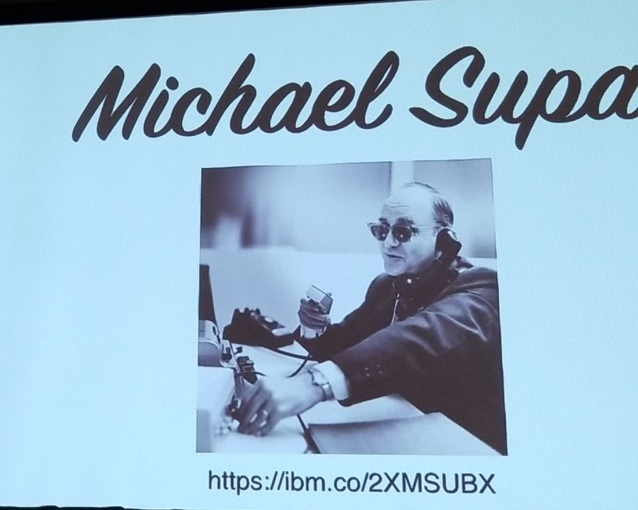

# Focusing on Focus

* Chris DeMars
* 7/18/2019 10am
* @saltnburnem
* chrisdemars.com
* [Tales from the Script](tftscript.com)
* [Codepen](https://bit.ly/2rebkfn)

<!-- Summary: -->
A super inpired talk about accessibility and why it is important followed by some tricks for new, upcoming, and useful css things.

He is a super fun guy and is connected with a lot of awesome people.

## Notes
<!-- This is a reference [^1] -->

https://ibm.co/2XMSUBX - Michael Supa


## Why?
For everyone, I can develop something for mom, at the end of the day I've don my job.

Three priorities for web development: Security, performance, accessibiliy. 

20% of people have a disability = 1.4 billion

"but Chris, people I work for don't have a disability..." bullshit! 20%

A11y is a "numeronym"

"We accessibility means that EVERYONE can use the web."

"The web is not a barrier to people with disabilities, it is the solution." [^1]

814 federal website accessibility lawsuites in 2017! [^2]

## Focus :focus
Why do we need focus? 
* twoblindbrothers.com - simulates stargardt's disease on their own website (pic: 10:23)
* if you can't see where you are typing - how do you know where you are typing?

Eric Meyer's reset removed focus but sets a reminder to set the focus styles. Eek!

Normalize - doesn't reset it

## :focus-ring & :-moz-focusring & :focus-visible
removes focus from mouse users but adds it to keyboard users

:-moz-focusring doens't work at all. 

"semantic markup is accessible by default"

"if you make your user think you are causing your user anxiety"

## tabindex
stick to tabindex=0

you can use it increments of 5

stay away from tabindex=-1 except for off screen navigation because it takes it out of the dom but javascript can focus it.

## Focus styles
borders, background, font, you can do them all

## :focus-visible 
in css 4 spec. there is a [focus visible polyfill](https://github.com/WICG/focus-visible)

adds the focus back in for the keyboard, allows you to clean up the mouse focus

## :focus-within
Una Cravitz good person to follow on twitter
```
form:focus-within {
 background: green
 color: black
}
```
the outer div gets focus when the focus is within that thing. 

This is supported **right now**

## Awesome People
pic: 10:43am
he suggests we follow them

## Awesome People
pic: 10:43

## Axe core
running accessibility audits. lighthouse uses axe core

can be used in a build or as an extension in your browser

## Insights
Can we build in wcag, axe, lighthouse into our testing process?

What do new graphical characters look like in screen reader? e.g. heart icon ❤️

## Resources
https://bit.ly/2KxP4VO

dequeuniversity.com has axe rules and a lot of great info

## About
When we think of CSS and Accessibility, what comes to mind? Is it adding alt attributes to image tags? How about color contrast? Is :focus given that much thought since browser's style these by default? Often, focus outlines are turned off in CSS to meet non-inclusive design standards, but this causes problems for keyboard users. How can we make the web a more inclusive place while maintaining design intent?.
 
As we build more and more things on the web, we must do our part in building awesome, accessible user experiences. Except native default browser styling of the :focus pseudo class is rather blah, don't you think? There has to be a better way to add some pizzazz to elements when users navigate without a mouse. In this talk, I will demo numerous ways to provide custom focus styles despite known limitations in the web platform. For users with disabilities, it's imperative that visual design finds a way to meet in the middle.

-----------------------
**tags**: ux/ui, introductory

<!-- Footnotes -->
[^1]: Get the quote

[^2]: bit.ly/2Ds4EPd

<!-- Markdown Cheatsheet https://www.markdownguide.org/cheat-sheet/ -->
