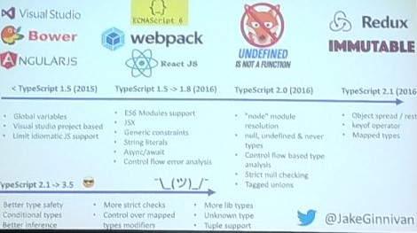

# Getting more out of TypeScript

* Jake Ginnivan
* 7/19/2019 3:30pm
* @JakeGinnivan
* github.com/jakeginnivan

<!-- Summary: -->
Jake Ginnivan, an austrailan demonstrated advanced typescript techniques like generics, union types, strict null checking, mapped types, conditional types. It was over my head but seems useful for reading more deeply into.

## Notes
 Quokkas are super cute.

Also the library s helpful. `//?`



### Generics
If you have a js function with parameters, they allow you to put in a placeholder in for the type. 

You use these to keep the same type across all the function, as it was when it came in. So it won't allow you to change the type but you don't have to define it up front.

interception type
    : combines two types

### Union Types
allows you to declare a type that is one or another. SO if you need something to be boolean or an object you can. 

`boolean | string` // code is probably in accurate, for illustration only

see unions2.ts for custom type guides

`kind: 'foo'` in the class

tagged unions allow you to do type checking for if conditions.

### Strict Null checking
You can't union with undefined anymore

Generics are placeholder arguments for real types which can be contrained and referenced instead of concrete types

unary types
* null
* undefined
* string literal

### mapped types
`type foo = { [bar in T: boolean;] }`
```
{
    [key in 'feature1' | 'feature2']: boolean

    type Describe<T extends {}> = {
        [key in keyof T]-?: string // Useful for a style guide / documentation
    }
}
```

### Built-in types
* record
    : is a transform one interface type into another
* pick

### config validation.ts
is a program to pull in environmental variables

make run time config type safe

### conditional types
you can set if statement for types based on the situation

### unknown
that is a new type that is 0 type

### Function overloads
allow us to have one implementation with multiple signatures

## Resources
* github.com/jakeginnivan
* [examples from talk](https://github.com/JakeGinnivan/practical-typescript)
* [quokkajs](quokkajs.com)

## About
JavaScript is a dynamic, object orientated language with a heap of quirks and TypeScript manages to move runtime errors to compile time. Unfortunately typing the wild west which is the JavaScript language has resulted in a massively powerful but sometimes daunting type system.
 
In this session Jake will take you through some of the less understood features which once you understand them, you will be able to use TypeScript more effectively.

You will leave knowing what Generics are, how control flow analysis and type narrowing works and a few other key features which will help you level up how you can use TypeScript more effectively.

-----------------------
**tags**: javascript, advanced

<!-- Footnotes -->
[^1]: Example footnote

<!-- Markdown Cheatsheet https://www.markdownguide.org/cheat-sheet/ -->
