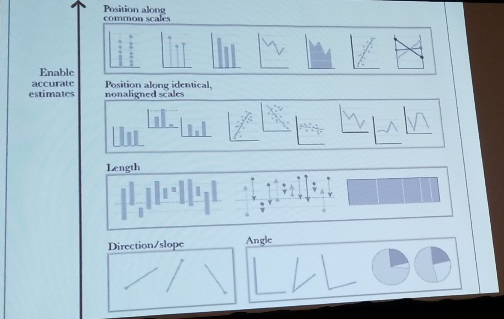

# Understanding Your Brain to Build Better Visualizations

* Walt Ritscher
* 7/18/2019 8:45am
* waltr@linkedin.com
* @WaltRitscher
* github.com/waltritscher

<!-- Summary: -->
Walt, a lynda.com/linkedin learning employee took us into a world of visualization. He provided best practices, tips for how to better show visualizations, and more resources. I particulaly liked the heirachy of differentiators/types of graphs that help you make a better impact.

Also, lots of tools!

## Notes
<!-- This is a reference [^1] -->

"every time i see a word cloud presented as insight i die a little inside" - jacob harris

Recommened book: Categories of Visualizations by Alberto Cairo

lollipop chart is a good alternative to bar charts

dotted cluster chart

### dataviscatalogue.com/ - resource
* helps you define methods, functions, etc

### github.com/d3/d3/wiki/Gallery
* visuallizations done with javascript
* great inspiration!
* go tot he visualization collection from the above link. Real data using above techinques

Data map: visualizing data on a map

### Infographic: 
multi-section visual representation of information intended to communicate one or more specific messages. usually designed created

### pie charts
our brains don't see pie slices very well. 

### data visualization
a display of data designed to enable: analysis, epxloration, discovery

it's also useful for  user interfaces
e.g. colorbox.io can give you steps for a range of colors for data display

babynamewizard.com
cool way to visualize popularity of names

## Our optical system
* visual recognition 60,000 times faster than text
* use what your brain is really good at

## Five differitiators
Highlight the differences with one of the following
1. size
2. color
3. position
4. contrast
5. shapre

What are you wanting people to discover in the data? differences? trends?

don't ask users to enter phone numbers in all flat strings. Humans don't read number in greater than 4-5 in length.

## best to worst graph

## Red/Green is a poor color choice
STOP
Colorblindness abounds
blue is a better choice to use with red

## motion and animation
if you have time stamped data: use motion to see the differences. e.g. with a slider or automate it for them 

## Our brain can be decieved!
patterns in bar charts may disquise your data

## Pie charts
They are bad - edward tufty

## proportion errors
also a problem, try stacking instead of increasing height and width

## Data Vis Tools
* Infogr.am
* Tableau
* Flourish
* Processing
* ProcessingJS

## Data Vis Tools - JS
* D3.js : dynamic, interactive
* DC.js : charting library

## Data vis - browser tools
* SVG
* 2D canvas
* Web GL

## NASA Purpetual Motion

Wow! amazing representation of ocean currents

## Resources
bit.ly/vizbooks

"The Truthful Art" by Alberto Cario <-- His favorite

"The Visual Display of Quantiative Information" - Edward Tufte <-- Dry book 

datavizcatalogue.com/resources.html

"The purpose of visualizition is insight not a picture"  - LOOKUP

Bret Victor worrydream.com is trying to find better ways of visualizing things

## About
No one questions that data is vital to application development, our teams spend untold hours obsessing about data structures. We build useful data layers and strive to eliminate processing roadblocks so that our data services are fast and fluid.

Do you spend that much effort on the visual portrayal of the data? If not, why not?

At some point in the data analytics cycle you need to show results to the stakeholder. That’s when choosing the correct visual representation of the data becomes vital. Do it wrong and the data is merely wrapped in pretty graphics; do it right and the user perceives their information in clear and meaningful patterns. 

This fast paced and entertaining session starts by looking at how your brain and optical system perceive data. This session explores the overall visualization concepts that make data easier to grasp. Do you know the best way to show data to your users, so that the information is clear and understandable? Come to this session to learn how to make your data shine. 

-----------------------
**tags**: ux/ui, introductory
